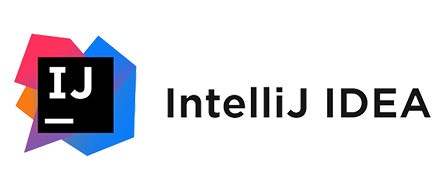

<h1 align="center">PabloCodevs</a> </h1>

### Hola 👋, soy Pablo.

- Soy un **Rookie en programación**
- Me gusta **leer** y escuchar **música**  
 

**Un poco sobre mí:**
 
- 📚 Actualmente estoy cursando mi último año en **DAW**.
- 💻 Al terminar, realizaré el **Curso de Especialización en Inteligencia Artificial y Big Data**.
- 🌱 Actualmente estoy aprendiendo **Desarrollo Web e Inglés**. 
- 💼 Me considero **Trabajador y organizado, con margen para mejorar siempre**.

<h2 dir="auto"></h2>

**Lenguajes y Herramientas:**

<code></code>
<code></code>
<code></code>
<code></code>
<code></code>
<code></code>
<code></code>
<code></code>
<code></code>
<code></code>
<code></code>

**Tecnologías pendientes:**

<code></code>
<code></code>
<code></code>
<h2 dir="auto"></h2>

  
  

 

  

<!--
## 🛠️ Lenguajes y Herramientas
 

  
<code></code>
<code></code>
<code></code>
 
<code></code>
<code></code>
<code></code>
 
<code></code>
<code></code>
<code></code>
 
<code></code>
<code></code>
<code></code>

 -->
##

<!-- Badges -->
 

<!-- Serpiente -->

<!-- Optional project showcase -->
<!-- 

  

-->
